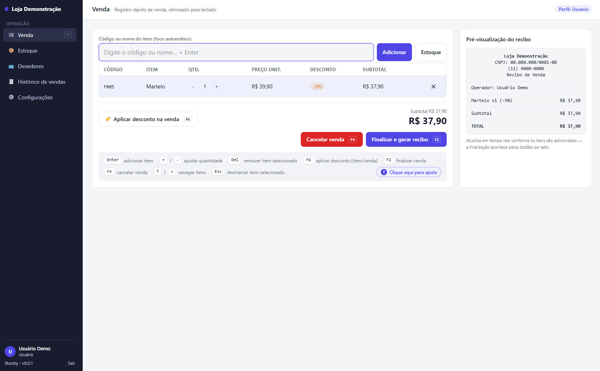
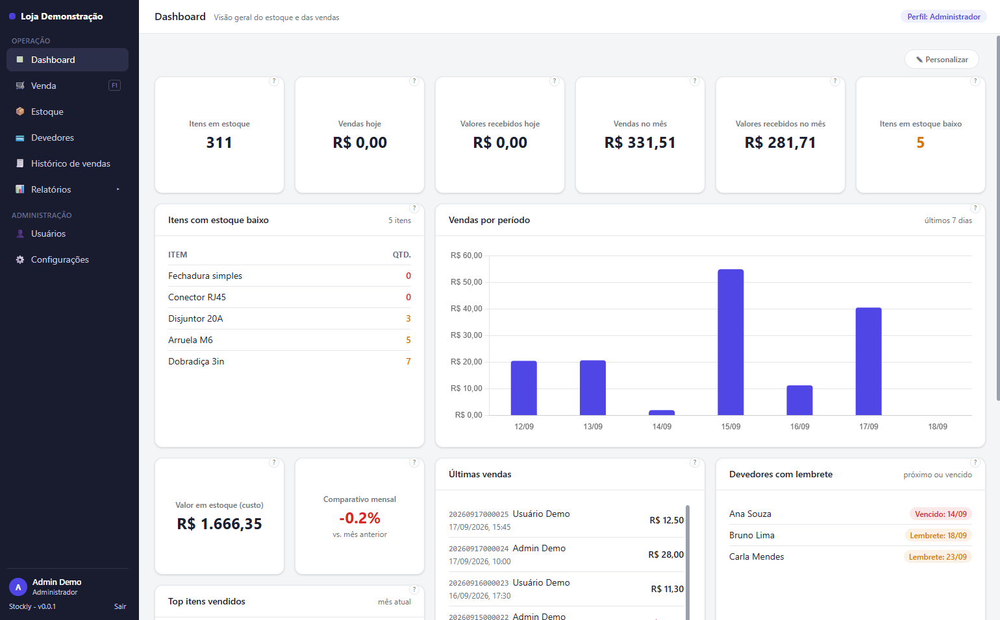
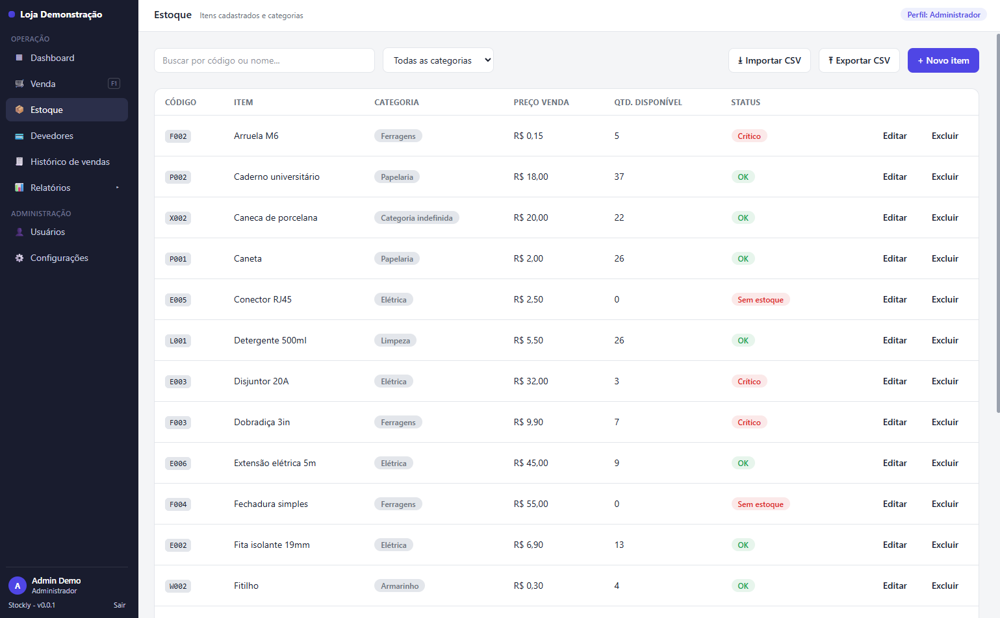
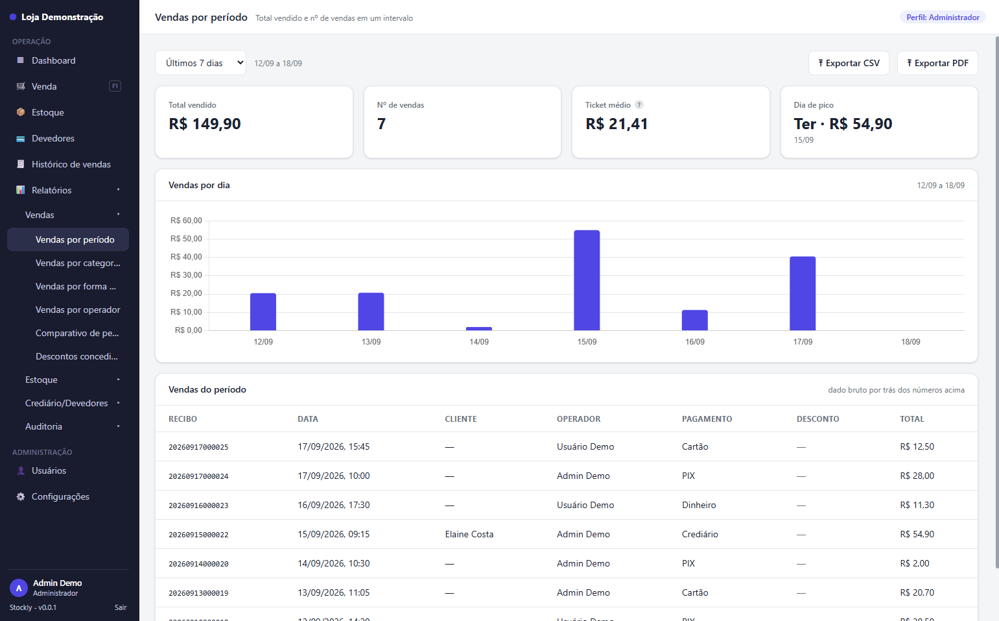

# Stockly

App desktop de controle de estoque e vendas (PDV) para uso local em um único computador — sem nuvem, sem sincronização, sem telemetria. Pensado para o dia a dia de um pequeno comércio: cadastrar itens, vender rápido (principalmente via teclado) e acompanhar o que entra e sai do caixa.

## Capturas de tela

<table>
<tr>
<td width="50%"><br><sub>Venda (PDV) — 100% via teclado, perfil Usuário</sub></td>
<td width="50%"><br><sub>Dashboard personalizável (Administrador)</sub></td>
</tr>
<tr>
<td width="50%"><br><sub>Estoque — cadastro, categorias, importação/exportação CSV</sub></td>
<td width="50%"><br><sub>Relatórios — catálogo completo, exportação em CSV/PDF</sub></td>
</tr>
</table>

## Funcionalidades

- **Perfis Administrador e Usuário** — login por seletor de perfil (escolhe quem é, digita só a senha); Usuário comum tem um menu reduzido, sem acesso a cadastro, dashboard ou relatórios
- **Estoque** — cadastro de itens por código único, categorias, alerta de estoque baixo (crítico e de atenção), importação/exportação em CSV com tela de conferência antes de aplicar
- **Venda (PDV) rápida via teclado** — busca de item por código ou nome, atalhos para desconto, cancelamento e finalização, sem depender do mouse
- **Recibo em PDF** — gerado a cada venda, numeração sequencial, com opção de reimprimir/regerar a qualquer momento
- **Histórico de vendas** — busca por recibo, cliente ou operador, com cancelamento/estorno (devolve o item ao estoque automaticamente)
- **Clientes e Crediário** — cadastro de cliente (CPF/CNPJ, data de nascimento), identificação opcional em qualquer venda, venda fiado com controle de saldo em aberto, lembrete de cobrança e histórico de compras/pagamentos
- **Dashboard personalizável** — cards de vendas, estoque baixo, valores recebidos e clientes com lembrete, arrastáveis e redimensionáveis
- **Relatórios** — por categoria (vendas, estoque, crediário, auditoria), incluindo comparativo de períodos, descontos concedidos e inadimplência, todos exportáveis em CSV/PDF
- **Backup automático do banco** — ao abrir o app e a cada 10 minutos, sem precisar de ação manual
- **Atualização automática** — o app verifica e instala novas versões sozinho
- **Nome da loja personalizável** — aparece na sidebar e no cabeçalho do recibo em PDF, com fallback pro padrão do app quando não configurado
- **Tema claro/escuro**

## Instalação

Baixe o instalador mais recente na página de [Releases](https://github.com/welbert/Stockly/releases).

## Build a partir do código-fonte

**Pré-requisitos:** [Rust](https://rustup.rs), [Node.js](https://nodejs.org), [pnpm](https://pnpm.io)

```bash
git clone https://github.com/welbert/Stockly
cd Stockly
pnpm install
pnpm tauri build
```

O instalador Windows (NSIS) é gerado em `src-tauri/target/release/bundle/nsis/`.

Para desenvolvimento com hot-reload:

```bash
pnpm tauri dev
```

## Dados e privacidade

Tudo fica em um arquivo SQLite local — nada sai da sua máquina.

| Dado | Local |
|---|---|
| Banco de dados | `%APPDATA%\com.welbert.stockly\` |
| Backup | pasta escolhida em Configurações |

## Desenvolvimento

Para arquitetura, convenções e documentação técnica, veja o [`CLAUDE.md`](CLAUDE.md).
